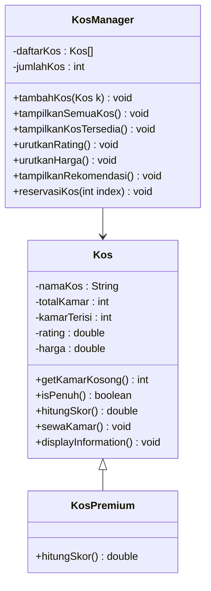
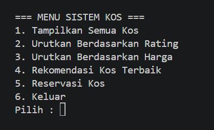
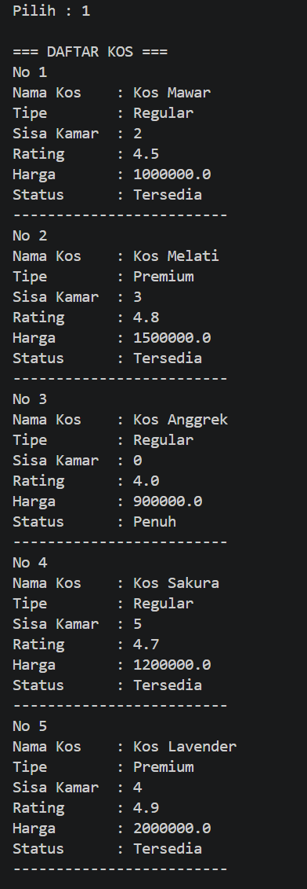
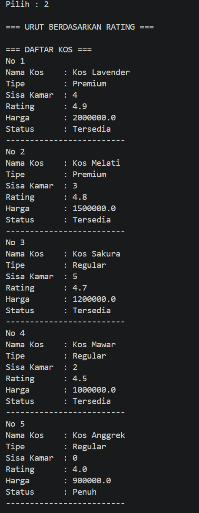
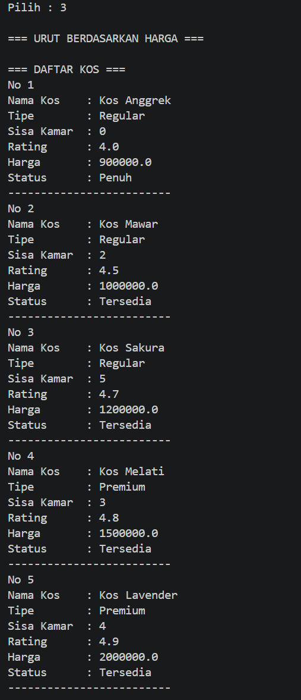
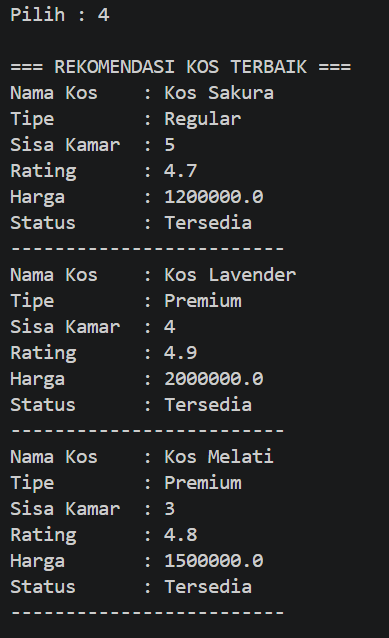
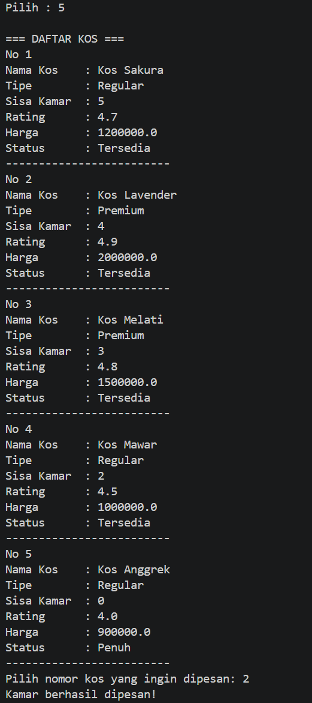
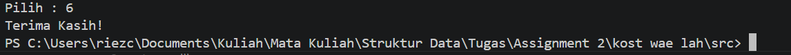

# Assignment 02
## Riezco Eka Bayu Witantra : NRP 5027251057
## Sistem Rekomendasi dan Reservasi Kos


**Deskripsi Kasus**

Mencari tempat tinggal sementara seperti kos merupakan salah satu kebutuhan penting bagi mahasiswa, khususnya bagi yang merantau. Namun, proses mencari kos yang sesuai dengan keinginan sering kali tidak mudah. Mahasiswa harus mempertimbangkan berbagai faktor seperti ketersediaan kamar, harga sewa, serta kualitas atau rating dari suatu kos. Selain itu, informasi mengenai kos umumnya tersebar di berbagai sumber dan tidak tersusun sistematis, sehingga hal ini akan menyulitkan dalam membandingkan pilihan yang ada.

Permasalahan lain yang juga sering muncul adalah kurangnya informasi secara real time mengenai ketersediaan kamar. Tidak jarang para calon penyewa harus datang secara langsung ke lokasi hanya untuk mengetahui apakah tersedia kamar kosong. Hal ini pastinya tidak efisien dari segi waktu dan tenaga.

Atas permasalahan ini, diperlukan sebuah sistem yang akan membantu pengguna untuk mengelola dan mengakses informasi kos secara lebih terstruktur. Oleh karena itu, dibuat sebuah program yang mampu merepresentasikan data kos dalam bentuk objek dan menyediakan fitur yang relevan.

Program ini akan memungkinkan pengguna untuk melihat daftar seluruh kos yang ada, mengetahui jumlah kamar kosong, rating, dan juga harga. Tidak hanya itul, sistem ini juga dilengkapi dengan fitur rekomendasi kos terbaik dah bahkan memiliki fitur untuk mereservasi kamar kos, dimana pengguna dapat memilih kos tertentu dan melakukan pemesanan. Setelah reservasi dilakukan.

**Class Diagram**



**Kode Program Java**

```java
import java.util.Scanner;

class Kos {
    protected String namaKos;
    protected int totalKamar;
    protected int kamarTerisi;
    protected double rating;
    protected double harga;

    public Kos(String namaKos, int totalKamar, int kamarTerisi, double rating, double harga) {
        this.namaKos = namaKos;
        this.totalKamar = totalKamar;
        this.kamarTerisi = kamarTerisi;
        this.rating = rating;
        this.harga = harga;
    }

    public int getKamarKosong() {
        return totalKamar - kamarTerisi;
    }

    public boolean isPenuh() {
        return kamarTerisi >= totalKamar;
    }

    public double hitungSkor() {
        return (getKamarKosong() * 2) + rating - (harga / 1000000);
    }

    public void sewaKamar() {
        if (!isPenuh()) {
            kamarTerisi++;
            System.out.println("Kamar berhasil dipesan!");
        } else {
            System.out.println("Maaf, kos sudah penuh.");
        }
    }

    public void displayInformation() {
        System.out.println("Nama Kos    : " + namaKos);
        if (this instanceof KosPremium) {
            System.out.println("Tipe        : Premium");
        } 
        else {
            System.out.println("Tipe        : Regular");
        }
        System.out.println("Sisa Kamar  : " + getKamarKosong());
        System.out.println("Rating      : " + rating);
        System.out.println("Harga       : " + harga);
        System.out.println("Status      : " + (isPenuh() ? "Penuh" : "Tersedia"));
        System.out.println("-------------------------");
    }
}

class KosPremium extends Kos {
    public KosPremium(String namaKos, int totalKamar, int kamarTerisi, double rating, double harga) {
        super(namaKos, totalKamar, kamarTerisi, rating, harga);
    }

    @Override
    public double hitungSkor() {
        return super.hitungSkor() + 2;
    }
}

class KosManager {
    private Kos[] daftarKos = new Kos[100];
    private int jumlahKos = 0;

    public void tambahKos(Kos k) {
        daftarKos[jumlahKos] = k;
        jumlahKos++;
    }

    public void tampilkanSemuaKos() {
        System.out.println("\n=== DAFTAR KOS ===");
        for (int i = 0; i < jumlahKos; i++) {
            System.out.println("No " + (i + 1));
            daftarKos[i].displayInformation();
        }
    }

    public void urutkanRating() {
        for (int i = 0; i < jumlahKos; i++) {
            for (int j = i + 1; j < jumlahKos; j++) {
                if (daftarKos[i].rating < daftarKos[j].rating) {
                    Kos temp = daftarKos[i];
                    daftarKos[i] = daftarKos[j];
                    daftarKos[j] = temp;
                }
            }
        }

        System.out.println("\n=== URUT BERDASARKAN RATING ===");
        tampilkanSemuaKos();
    }

    public void urutkanHarga() {
        for (int i = 0; i < jumlahKos; i++) {
            for (int j = i + 1; j < jumlahKos; j++) {
                if (daftarKos[i].harga > daftarKos[j].harga) {
                    Kos temp = daftarKos[i];
                    daftarKos[i] = daftarKos[j];
                    daftarKos[j] = temp;
                }
            }
        }

        System.out.println("\n=== URUT BERDASARKAN HARGA ===");
        tampilkanSemuaKos();
    }

    public void tampilkanRekomendasi() {
        for (int i = 0; i < jumlahKos; i++) {
            for (int j = i + 1; j < jumlahKos; j++) {
                if (daftarKos[i].hitungSkor() < daftarKos[j].hitungSkor()) {
                    Kos temp = daftarKos[i];
                    daftarKos[i] = daftarKos[j];
                    daftarKos[j] = temp;
                }
            }
        }

        System.out.println("\n=== REKOMENDASI KOS TERBAIK ===");

        int batas = (jumlahKos < 3) ? jumlahKos : 3;

        for (int i = 0; i < batas; i++) {
            daftarKos[i].displayInformation();
        }
    }

    public void reservasiKos(int index) {
        if (index >= 0 && index < jumlahKos) {
            daftarKos[index].sewaKamar();
        } else {
            System.out.println("Pilihan tidak valid!");
        }
    }
}

public class Main {
    public static void main(String[] args) {

        Scanner input = new Scanner(System.in);
        KosManager manager = new KosManager();

        manager.tambahKos(new Kos("Kos Mawar", 10, 8, 4.5, 1000000));
        manager.tambahKos(new KosPremium("Kos Melati", 8, 5, 4.8, 1500000));
        manager.tambahKos(new Kos("Kos Anggrek", 6, 6, 4.0, 900000));
        manager.tambahKos(new Kos("Kos Sakura", 12, 7, 4.7, 1200000));
        manager.tambahKos(new KosPremium("Kos Lavender", 10, 6, 4.9, 2000000));

        int pilihan;

        do {

            System.out.println("\n=== MENU SISTEM KOS ===");
            System.out.println("1. Tampilkan Semua Kos");
            System.out.println("2. Urutkan Berdasarkan Rating");
            System.out.println("3. Urutkan Berdasarkan Harga");
            System.out.println("4. Rekomendasi Kos Terbaik");
            System.out.println("5. Reservasi Kos");
            System.out.println("6. Keluar");
            System.out.print("Pilih : ");
            pilihan = input.nextInt();

            switch (pilihan) {
                case 1:
                    manager.tampilkanSemuaKos();
                    break;
                case 2:
                    manager.urutkanRating();
                    break;
                case 3:
                    manager.urutkanHarga();
                    break;
                case 4:
                    manager.tampilkanRekomendasi();
                    break;
                case 5:
                    manager.tampilkanSemuaKos();
                    System.out.print("Pilih nomor kos yang ingin dipesan: ");
                    input.nextLine();
                    int pilihKos = Integer.parseInt(input.nextLine());
                    manager.reservasiKos(pilihKos - 1);
                    break;
                case 6:
                    System.out.println("Terima Kasih!");
                    break;

                default:
                    System.out.println("Pilihan tidak valid!");
            }
        } while (pilihan != 6);

        input.close();

    }
}

```

**Output**

Tampilan Menu


Tampilan informasi kos


Tampilkan berdasarkan rating


Tampilkan berdasarkan harga


Tampilkan top 3 rekomendasi


Tampilkan fungsi pesan kos


Tampilkan ketika pilih keluar


**Prinsip OOP yang digunakan**

1. Encapsulaltion
   Encapsulation adalah proses untuk menyatukan data (atribut) dan fungsi ke dalam satu tempat yaitu class. 
   Pada program ini, encapsulation diterapkan pada class `kos`. Class ini memiliki beberapa atribut seperti `namaKos`, `totalKamar`, `kamarTerisi`, `rating`, dan `harga`. Atribut tersebut dapat diakses melalui fungsi seperti `getKamarKosong()`, `isPenuh()`, `hitungSkor`, `sewaKamar`, dan `displayInformation`.

   code Encapsulation
   ```java
   class Kos {
        protected String namaKos;
        protected int totalKamar;
        protected int kamarTerisi;
        protected double rating;
        protected double harga;

        public Kos(String namaKos, int totalKamar, int kamarTerisi, double rating, double harga) {
            this.namaKos = namaKos;
            this.totalKamar = totalKamar;
            this.kamarTerisi = kamarTerisi;
            this.rating = rating;
            this.harga = harga;
        }

        public int getKamarKosong() {
            return totalKamar - kamarTerisi;
        }

        public boolean isPenuh() {
            return kamarTerisi >= totalKamar;
        }

        public double hitungSkor() {
            return (getKamarKosong() * 2) + rating - (harga / 1000000);
        }

        public void sewaKamar() {
            if (!isPenuh()) {
                kamarTerisi++;
                System.out.println("Kamar berhasil dipesan!");
            } else {
                System.out.println("Maaf, kos sudah penuh.");
            }
        }

        public void displayInformation() {
            System.out.println("Nama Kos    : " + namaKos);
            System.out.println("Sisa Kamar  : " + getKamarKosong());
            System.out.println("Rating      : " + rating);
            System.out.println("Harga       : " + harga);
            System.out.println("Status      : " + (isPenuh() ? "Penuh" : "Tersedia"));
            System.out.println("-------------------------");
        }
    }
    ```

2. Inheritance
   Inheritance adalah pewarisan, dimana sebuah class dapat mewarisi atribut dan method dari class lain.
   Pada program ini, class `kosPremium` merupakan turunan dari class `Kos`. Class ini mewarisi semua atribut dan fungsi yang ada di clss `Kos`. Sehingga tidak perlu dilakukan penulisan ulang atribut yang sama. Sehingga program menjadi lebih efisien dan fleksibel.
   ```java
    class KosPremium extends Kos {
        public KosPremium(String namaKos, int totalKamar, int kamarTerisi, double rating, double harga) {
            super(namaKos, totalKamar, kamarTerisi, rating, harga);
        }

        @Override
        public double hitungSkor() {
            return super.hitungSkor() + 2;
        }
    }
   ```

3. Polymorphism
   Polymorphism adalah suatu metode yang dapat memiliki bentuk berbeda dari class yang sebelumnya.
   Method `hitungSkor()` pada class `Kos` dioverride oleh class `KosPremium` untuk memberi nilai tambahan pada kos premium. Hal ini menyebabkan `KosPremium` memiliki sifat yang beda dari `Kos` biasa.
   ```java
    @Override
    public double hitungSkor() {
        return super.hitungSkor() + 2;
    }
   ```

4. Abstraction
   Abstraction ialah konsep menyederhanakan sistem dengan implementasi dan menampilkan fungsi fungsi penting.
   Pada program ini, abstraction diterapkan melalui menu interaktif. Penggunan hanya perlu memilih opsi yang tertera di sistem.
   ```java
    switch (pilihan) {
        case 1:
            manager.tampilkanSemuaKos();
            break;
        case 2:
            manager.urutkanRating();
            break;
        case 3:
            manager.urutkanHarga();
            break;
        case 4:
            manager.tampilkanRekomendasi();
            break;
        case 5:
            manager.tampilkanSemuaKos();
            System.out.print("Pilih nomor kos yang ingin dipesan: ");
            input.nextLine();
            int pilihKos = Integer.parseInt(input.nextLine());
            manager.reservasiKos(pilihKos - 1);
            break;
        case 6:
            System.out.println("Terima Kasih!");
            break;

        default:
            System.out.println("Pilihan tidak valid!");
    }
   ```

**Keunikan**

Program yang dibuat tidak hanya berfungsi untuk menampilkan data kos, tetapi juga memiliki tambahan fitur yang membuat berbeda dari umumnya.

Salah satu keunikan yang ada adalah program ini ada sistem rekomendasi kos terbaik. Sistem tidak memilih secara acak melainkan melakukan perhitungan skor yang mempertimbangkan beberapa faktor seperti jumlah kamar kosong, rating, harga. Dengan ini, program dapat memberi rekomendasi yang lebih relevan dan membantu untuk mengambil keputusan.

Adanya fitur reservasi kamar, pengguna dapat memilih kos dan melakukan pemesanan. Setelah dilakukan, jumlah kamar tersedia akan berkurang.

Program juga dirancang dalam bentuk menu interaktif, sehingga pengguna dapat mudah berpindah antara berbagai fitur yang ada.

Program juga mampu menampilkan informasi keseluruhan dari semua kos yang ada dengan detail. Dengan demikian penggunan tidak perlu membuka fitur tambahan untuk mengetahui apakah suatu kos masih ada atau tidak.

Sebagai kesimpulan, program ini tidak hanya menampilkan informasi, tetapi juga memberikan pengalaman interaktif.

##